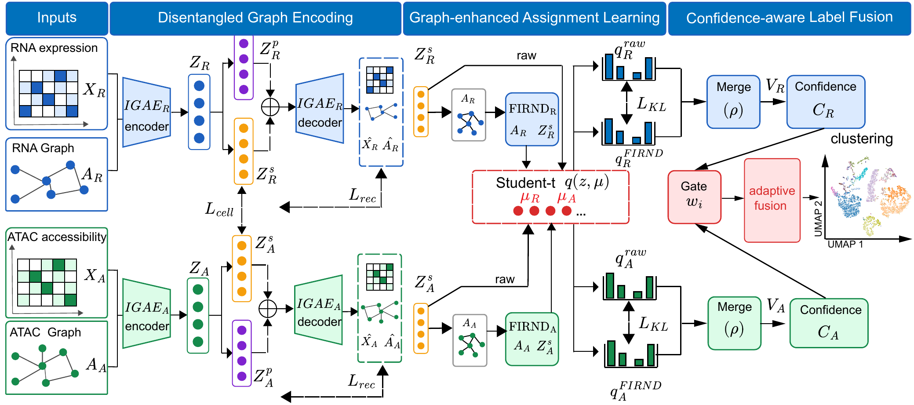

# scDPCL

**Disentangled Private-Shared Collaborative Learning for Matched Single-Cell Multi-Omics Clustering**

<p align="center">
  
</p>

scDPCL is a graph-based deep clustering framework for matched single-cell multi-omics data. It integrates RNA expression and chromatin accessibility profiles measured from the same cells through four main components: modality-specific graph encoding, shared-private representation disentanglement, FIRND-enhanced assignment learning, and confidence-aware label fusion.

The shared representations capture biological signals that are consistent across modalities, while the private representations retain modality-specific information. Raw and graph-refined assignment distributions are combined within each modality, and cell-level confidence is then used to adaptively fuse RNA and ATAC evidence for the final clustering result.

## Requirements

The experiments were developed with the following environment:

- Python 3.11.4
- PyTorch 2.0.1
- NumPy 1.24.4
- SciPy 1.13.0
- scikit-learn 1.3.2
- tqdm 4.66.1
- Matplotlib 3.7.2
- JupyterLab or Jupyter Notebook for the tutorials

CUDA is recommended for model training.

## Usage

### Clone the repository

```bash
git clone https://github.com/chenzheng311/scDPCL.git
cd scDPCL
```

### Code structure

- `src/data_loader.py`: loads preprocessed features and constructs cell graphs.
- `src/encoder.py`: implements the base graph autoencoder.
- `src/encoder_dpcl.py`: implements shared-private disentanglement and assignment modules.
- `src/scDPCL.py`: defines the complete scDPCL architecture and FIRND propagation.
- `src/ops_loss_dpcl.py`: defines reconstruction, contrastive, and disentanglement losses.
- `src/main_dpcl.py`: provides the model training and evaluation pipeline.
- `src/utils_dpcl.py`: provides clustering, fusion, evaluation, and recovery utilities.
- `config/`: stores dataset metadata and reproducible experiment profiles.
- `tutorial/`: contains notebooks for PBMC-3k, PBMC-10k, and BMNC.
- `run.py`: provides a unified command-line entry point for the organized release.

### Prepare data

Input data and pretrained weights are not included in this repository. The reproduction wrapper currently expects this repository to be placed as `scDPCL_release/` inside the complete project working tree:

```text
project-root/
  input/
    PBMC-10k/
    PBMC-3k/
    BMNC/
  model/
    main_dpcl.py
  model_pretrained/
  scDPCL_release/
```

Each dataset directory should contain the preprocessed RNA and ATAC feature matrices, labels, and the required graph files. Run a dry check before training to list any missing files.

### Example commands

Take PBMC-10k as an example:

```bash
python scDPCL_release/run.py --dataset PBMC-10k --dry-run
python scDPCL_release/run.py --dataset PBMC-10k
```

The other benchmark datasets can be run in the same way:

```bash
python scDPCL_release/run.py --dataset PBMC-3k
python scDPCL_release/run.py --dataset BMNC
```

The default `two_group` profile uses one configuration for PBMC-10k and a shared configuration for PBMC-3k and BMNC. Additional profiles are available through `--profile unified` and `--profile legacy_tuned`. See `config/TWO_GROUP_PROTOCOL.md`, `config/UNIFIED_PROTOCOL.md`, and `config/datasets.json` for details.


