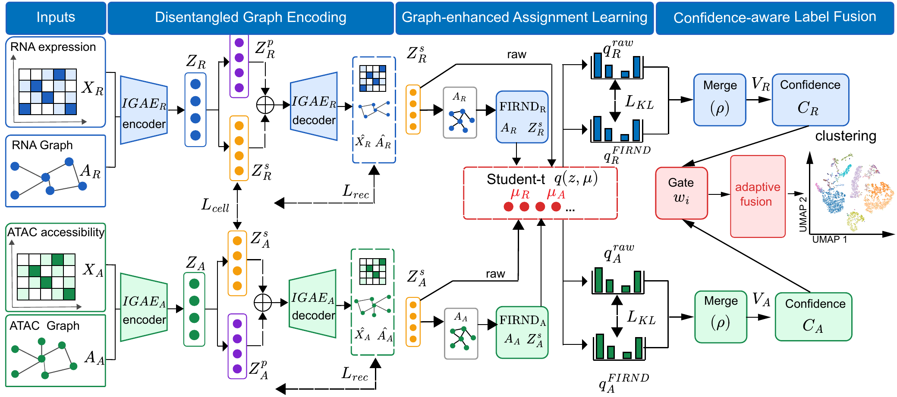

# scDPCL

**Disentangled Private-Shared Collaborative Learning for Matched Single-Cell Multi-Omics Clustering**



scDPCL integrates matched RNA and ATAC profiles for single-cell clustering. This repository contains the standalone reproduction package and the current two-group configuration.


## 运行

```powershell
git clone https://github.com/chenzheng311/scDPCL.git
cd scDPCL

# 激活已安装 requirements.txt 所列依赖的 Python 3.11 环境
# 本机复现实验使用：conda activate sedrenv

# 检查全部输入并打印命令，不启动训练
python run.py --dataset all --dry-run

# 按当前参数训练单个数据集
python run.py --dataset PBMC-10k
python run.py --dataset PBMC-3k
python run.py --dataset BMNC

# 依次训练三个数据集
python run.py --dataset all
```

从任意工作目录使用 `python <本包绝对路径>/run.py ...` 也可以运行。使用 `src/main_dpcl.py` 的完整命令时，请先切换到本包根目录。


## 文件结构

```text
scDPCL/
  run.py                   统一入口，使用当前 two_group 参数
  create_tutorials.py       重新生成三个 notebook
  src/                     实际实验使用的完整 scDPCL 源码
  baseline/                scMDCL 初始化/对照实验相关完整源码
  config/                  当前参数、数据元信息、复现及参数导出脚本
  input/                   PBMC-10k、PBMC-3k、BMNC 的特征、标签和图
  model_pretrained/        五个已有预训练文件及说明
  reference_results/       当前配置对应的三个数据集日志、指标、标签和嵌入
  outputs/                 新运行的日志与结果
  tutorial/                三个数据集的 notebook
  environment/             sedrenv 实际环境记录
  provenance/              原文件来源及 SHA-256
  verification/            检查说明；运行验证后生成报告
  verify_release.py        数据、参数、权重、前向/反向和入口检查
  FILES_SHA256.json        交付文件校验清单
  FULL_PARAMETERS.md       中文完整参数表
  requirements.txt         核心依赖的实际版本
```

`src/main_dpcl.py`、`src/encoder_dpcl.py` 使用当前 `model/` 中实际运行的版本。网络、损失、训练逻辑原样复制；发布入口仅调整路径、保留当前配置并增加参数记录。模型源码与本次本地完整包保持一致。

## 实际环境

已核实的本机环境：Python 3.11.3、PyTorch 2.1.0（CUDA 12.1）、NumPy 1.26.4、SciPy 1.14.1、scikit-learn 1.7.0，显卡 NVIDIA GeForce RTX 4070 Ti SUPER。

新环境使用 Python 3.11，并安装随包依赖：

```powershell
python -m pip install -r requirements.txt
python -c "import torch; print(torch.__version__, torch.version.cuda, torch.cuda.is_available())"
python verify_release.py
```

依赖文件固定 Python 包版本；CUDA 构建信息单独记录于 `environment/runtime.json`，不保证不同平台自动安装相同 CUDA 构建。完整已安装包列表见 `environment/installed_packages.json`。Notebook 另需安装 Jupyter，CLI 不需要。


## 版本记录

本次更新将运行入口改为仓库内独立路径，补齐三个数据集、五个预训练文件、三个 notebook 和全部 264 条参数记录。当前只提供 `two_group` 方案。源文件对应关系见 `provenance/source_files.json`，交付核验见 [DELIVERY_CHECKS.md](DELIVERY_CHECKS.md)。
